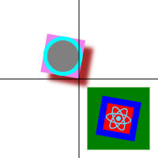

# React 2D Canvas
Draw text, images, and shapes on an HTML Canvas element using a declarative JSX syntax. The library is light weight and builds on top of custom web components from the  Web Components standard. 

React 2D Canvas was created with simple 2D canvas games in mind, with focus on resource efficiency and the ease of development that React offers.

## Table of Content
* [Example Usage](#example-usage)
* [Browser Support](link)
* [API](link)
    * [\<Stage>](link)
    * [\<Layer>](link)
    * [Shapes Components](link)
        * [Event Handlers](link)
        * [Nesting and Inheritance](link)
    * [\<Rectangle>](link)
    * [\<RoundedRectangle>](link)
    * [\<Circle>](link)
    * [\<Arc>](link)
    * [\<Label>](link)
    * [\<Image>](link)
    
## Example Usage



*A cross with line segments at `x = 100` and `y = 100` has been added to the image above for reference.*

```js
import { 
  Stage, 
  ScaleMode, 
  Layer, 
  Rectangle, 
  Image, 
  Circle
} from 'react-2d-canvas';
import logo from './images/logo192.png'

function App() {
  return (
    <Stage
      width={200}
      height={200}
      scaleMode={ScaleMode.SCALE_TO_FIT}
    >
      <Layer>
        <Rectangle
          x={150}
          y={150}
          width={80}
          height={80}
          backgroundColor="green"
        >
          <Image
            width={50}
            height={50}
            backgroundColor="red"
            borderColor="blue"
            borderWidth={8}
            src={logo}
            rotation={10 * Math.PI / 180}
          />
        </Rectangle>
        <Rectangle
          x={100}
          y={100}
          width={50}
          height={50}
          backgroundColor="violet"
          rotation={10 * Math.PI / 180}
          originX={1}
          originY={1}
          shadowColor="brown"
          shadowOffsetX={10}
          shadowOffsetY={10}
          shadowBlur={5}
        >
          <Circle
            radius={50}
            backgroundColor="gray"
            borderWidth={10}
            borderColor="cyan"
            scaleX={0.5}
            scaleY={0.5}
            originX={1}
            originY={1}
          />
        </Rectangle>
      </Layer>
    </Stage>
  );
}
```

## Browser Support

React 2D Canvas is supported by all modern web browsers. The support is mainly limited by the use of [Autonomous custom elements](https://caniuse.com/custom-elementsv1).

The following browser versions are supported
* Edge >79
* Firefox >63
* Chrome >54
* Safari >10.1
* Opera >41
* Safari iOS >10.3
* Android browser >94
* Opera Mobile >64
* Chrome for Android >94
* Firefox for Android >92
* UC browser for Android >12.12

## API

All components and the `ScaleMode` name space are exported individually from the main package.

```js
import { 
  Stage, 
  ScaleMode, 
  Layer, 
  Rectangle,
  /* etc */ 
} from 'react-2d-canvas';
```

### \<Stage>

The `<Stage>` component is the outermost container and should have one or several `<Layer>` child components.
The `<Stage>` component handles the dimensions and scaling of the child `<Layer>` components.

```jsx
import { Stage, ScaleMode } from 'react-2d-canvas';

<Stage width={600} height={400} scaleMode={ScaleMode.SCALE_TO_FIT}>
  {/*...*/}
</Stage>
```

Properties / Attributes | Description | Default value
--- | --- | ---
`scaleMode` | Controlling how the child `<Layer>` components scale. Available options are `ScaleMode.SCALE_TO_FIT` or `ScaleMode.SCALE_TO_COVER` | &nbsp;
`width` | Setting the width of the child `<Layer>` components. | `300`
`height` | Setting the height of the child `<Layer>` components. | `300`
`backgroundColor` | Setting the background color for the `<Stage>` component. Accepts a CSS color value. | &nbsp;

### \<Layer>

```js
<Stage
  width={600}
  height={400}
  scaleMode={ScaleMode.SCALE_TO_FIT}
>
  <Layer>
    {/* Static background comoponents */}
  </Layer>
  <Layer>
    {/* Game play action and animation components */}
  </Layer>
  <Layer>
    {/* UI and interactive components */}
  </Layer>
</Stage>
```

Each `<Layer>` component holds an HTML Canvas element. Using multiple sibling `<Layer>` components is a good way of
optimizing canvas redrawing when animating content. See for
instance [Use multiple layered canvases for complex scenes](https://developer.mozilla.org/en-US/docs/Web/API/Canvas_API/Tutorial/Optimizing_canvas#use_multiple_layered_canvases_for_complex_scenes)
for a detailed explanation of this optimization strategy.

The follwoing event handlers passed to the `<Layer>` component will be forwarded to the underlying HTML `<canvas>`
element. Note that event handlers are typically not passed to the `<Layer>` component. Instead, attached directly on
the different child components, such as `<Rectangle>`, `<Circle>` etc.

* `onClick`
* `onMouseMove`
* `onMouseDown`
* `onMouseUp`
* `onDoubleClick`
* `onContextMenu`
* `onMouseOut`
* `onMouseOver`

### Shapes Components

Shape components, such as `<Rectangle>`, `<Circle>`, and `<Label>` are available for representing different graphical elements and user interface controls.

All shape components have the following common attributes:

Common Attributes | Description | Default value
--- | --- | ---
`x` | X-coordinate | `0`
`y` | Y-coordinate | `0`
`backgroundColor` | Background color  expressed as a CSS color string | &nbsp;
`borderColor` | Border color expressed as a CSS color string
`borderWidth` | Border width in pixels | `1`
`opacity` | Opacity in the range of `0` to `1` | `1`
`originX` | Origin on the x-axis in relation to the width of the shape, in the range of `0` to `1`.<br /><br />A value of `0` will left align the shape, `0.5` will center align, and `1` will right align the shape. Also affects the rotation origin.  | `0.5`
`originY` | Same as `originX`, but related to the y-axis.  | `0.5`
`rotation` | Rotation in radians. The rotation origin is controlled by the values of `orignX` and `originY` | `0`
`scaleX` | Scaling factor in horizontal direction.  | `1`
`scaleY` | Scaling factor in the vertical direction. | `1`
`shadowColor` | Shadow color expressed as a CSS color string. | &nbsp;
`shadowBlur` | Level of shadow blur. | `0`
`shadowOffsetX` | Distance that shadows will be offset horizontally. | `0`
`shadowOffsetY` | Distance that shadows will be offset vertically. | `0`
`borderDash` | String of comma separated numbers that define the border dash pattern. | &nbsp; 

#### Event Handlers
All shapes accept the following mouse event handlers:
* `onClick`
* `onMouseMove`
* `onMouseDown`
* `onMouseUp`
* `onDoubleClick`
* `onContextMenu`
* `onMouseOut`
* `onMouseOver`

#### Nesting and Inheritance

Shape components can well be nested. Child components will be affected by the following attributes of their parent component:

Attributes affected by parent | Description
--- | ---
`x` | Child's x-coordinate will be an offset of the parent's x-coordinate
`y` | Same as above, but for the y-coordinate
`opacity` | Child's opacity will be multiplied by the parent's opacity
`rotation` | Child's rotation will be increased by the parent's rotation

Nesting components makes it possible to update the relative position, opacity and rotation of a group of child
components, by just changing the corresponding property on their common ancestor.

### \<Rectangle>

```js
<Stage
  width={600}
  height={400}
  scaleMode={ScaleMode.SCALE_TO_FIT}
>
  <Layer>
    <Rectangle
      x={100}
      y={100}
      width={75}
      height={150}
      backgroundColor="#666"
    />
  </Layer>
</Stage>
```
The `<Rectangle>` component accepts all common attributes, and the following additional attributes:

Attributes | Description | Default value
--- | --- | ---
`width` | Pixel width. | `0`
`height` | Pixel height. | `0`

### \<RoundedRectangle>
```js
<Stage
  width={600}
  height={400}
  scaleMode={ScaleMode.SCALE_TO_FIT}
>
  <Layer>
    <RoundedRectangle
      x={100}
      y={100}
      width={75}
      height={150}
      radius={20}
      backgroundColor="#666"
    />
  </Layer>
</Stage>
```

The `<RoundedRectangle>` component accepts all common attributes, and the following additional attributes:

Attributes | Description | Default value
--- | --- | ---
`width` | Pixel width. | `0`
`height` | Pixel height. | `0`
`radius` | Corner radius. | `0`

### \<Circle>
```js
<Stage
  width={600}
  height={400}
  scaleMode={ScaleMode.SCALE_TO_FIT}
>
  <Layer>
    <Circle
      x={100}
      y={100}
      radius={20}
      backgroundColor="#666"
    />
  </Layer>
</Stage>
```
The `<Circle>` component accepts all common attributes, and the following additional attributes:

Attributes | Description | Default value
--- | --- | ---
`radius` | Radius. | `0`

### \<Arc>
```js
<Stage
  width={600}
  height={400}
  scaleMode={ScaleMode.SCALE_TO_FIT}
>
  <Layer>
    <Arc
      x={100}
      y={100}
      radius={20}
      backgroundColor="#666"
      startAngle={45 * Math.PI / 180}
      endAngle={180 * Math.PI / 180}
    />
  </Layer>
</Stage>
```
The `<Arc>` component accepts all common attributes, and the following additional attributes:

Attributes | Description | Default value
--- | --- | ---
`radius` | Radius. | `0`
`startAngle` | Start angle in radians measured from 12'o clock. | `0`
`endAngle` | End angle in radians measured from 12'o clock. | `0`
`counterclockwise` | Boolean value indicating direction of drawing from `startAngle` to `endAngle`. | `false`

### \<Label>
```js
<Stage
  width={600}
  height={400}
  scaleMode={ScaleMode.SCALE_TO_FIT}
>
  <Layer>
    <Label
      x={100}
      y={100}
      color="red"
      fontFamily="Helvetica"
      fontSize={30}
      fontStyle="italic"
      fontWeight="bold"
      align="center"
      baseline="middle"
      maxWidth={40}
      startAngle={45 * Math.PI / 180}
      endAngle={180 * Math.PI / 180}
    >
      A single line of text
    </Label>
  </Layer>
</Stage>
```
The `<Label>` component accepts all common attributes (except `originX` and `originY`), and the following additional attributes:

(Use the `align` and `baseline` attributes to change the origin of the component.)

Attributes | Description | Default value
--- | --- | ---
`color` | Text color expressed as CSS color string. | &nbsp;
`fontSize` | Pixel size of the text. | `10`
`fontFamily` | Font family name of the text. | `"sans-serif"`
`fontStyle` | Font style expressed using one of the following values `normal`, `italic`, `oblique`. | &nbsp;
`fontWeight` | Font weight expressed in CSS font weight string or number. | `normal`
`baseline` | Baseline of the text using one of the following values `top`, `hanging`, `middle`, `alphabetic`, `ideographic`, `bottom`. | `"alphabetic"`
`align` | Horizontal alignment of the text using one of the following values `left`, `right`, `start`, `end`, `center`. | `"start"`
`maxwidth` | Pixel width at which point the text will be cropped and appended with ellipses to fit within the `maxWidth`. | `Infinity`

### \<Image>
```js
<Stage
  width={600}
  height={400}
  scaleMode={ScaleMode.SCALE_TO_FIT}
>
  <Layer>
    <Image
      x={100}
      y={100}
      width={48}
      height={48}
      src={myIcon}
    />
  </Layer>
</Stage>
```
The `<Image>` component accepts all common attributes, and the following additional attributes:

Attributes | Description | Default value
--- | --- | ---
`src` | Path to image. | &nbsp;

## License
MIT
